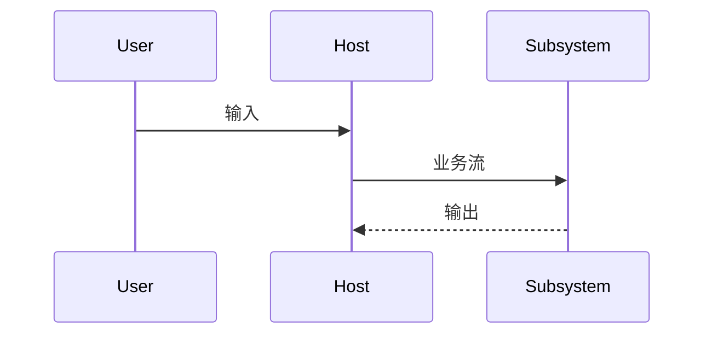

# CLCA 产出模板

复制到目标子系统 `docs/` 或设计讨论 Issue 中使用。

---

## 需求分期 `docs/requirements/P0.yaml`（示例）

```yaml
# P0 — 变更须重走 A/B
p0:
  - id: P0-001
    描述: 对外仅 memory_store / memory_retrieve，载荷 string
    验收点: MCP tools/list 仅含两工具；required 仅为 content/context
  - id: P0-002
    描述: 执行 Agent 不得主动调用本 MCP
    验收点: 不在 capabilities.attach_to 中

p1:
  - id: P1-001
    描述: Host OnTurnStore / OnTurnRetrieve 钩子
    验收点: gateway 单点调用；go test 基石测通过

p2:
  - id: P2-001
    描述: Memory Agent + 事实图
    验收点: ARCHITECTURE_DRIFT 中 stub 项关闭
```

---

## 系统 I/O 一页纸

```markdown
## 系统名
## 封闭边界
（箱内组件列表）

## 输入
| 来源 | 载荷 | 触发 |
|------|------|------|

## 输出
| 去向 | 载荷 | 失败降级 |

## 非目标
-

## MCP/Host（若适用）
| 项 | 约定 |
|----|------|
| 调用方 | Host 钩子 / 否 attach_to Exec |
| 载荷 | string-only |
| retrieve 失败 | 空 hints，不阻断 Process |
```

---

## A 阶段底稿

### 角色表

| 角色 ID | 职责 | 不做 | 映射 P0 |
|---------|------|------|---------|
| R-Host | | | P0-xxx |

### 链路表

| 链路 ID | 类型 | 方向 | 载荷 | 触发 | 映射 P0 |
|---------|------|------|------|------|---------|
| L-001 | 业务 | A→B | | | |

### 孤立性审查

| 对象 | 状态 | 动作 |
|------|------|------|
| R-xxx | 孤立 / OK | 删除 / 保留 |

### 闭环结论

- [ ] 通过，进入 B
- [ ] 不通过，回滚 A

---

## B 阶段：DESIGN_INTENT 条目模板

```markdown
## YYYY-MM-DD — [决策标题]

### 设计意图
### 原因
### 影响
- Agent/代码须遵守：
### 非目标
```

---

## B 阶段：文字 MVP 脚本（两轮）

### 回合 1 — Happy path

**用户**：…

**系统（标明角色/链路）**：
- R-Host: …
- L-001: …

**数据流摘要**：…

### 回合 2 — 失败 / 边界

**用户**：寒暄 / 超时 / …

**系统**：
- 反馈流 L-xxx: skipped=true, hints=""

**是否通过互审**：是 / 否 → 回滚 A

---

## B 阶段：序列图（Mermaid 占位）



---

## C 阶段：基石测试计划

| 基石 | 可观测规律 | 测试名 | 需求 ID |
|------|------------|--------|---------|
| 每 user 消息 retrieve | gateway 调用 MCP | TestP0_... | P0-001 |

---

## 开放问题（B 末尾）

```markdown
## 开放问题（YYYY-MM-DD）
1.
2.
3.
```
